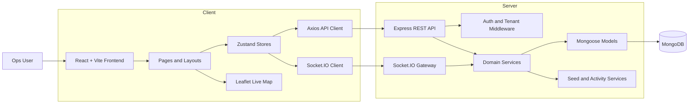
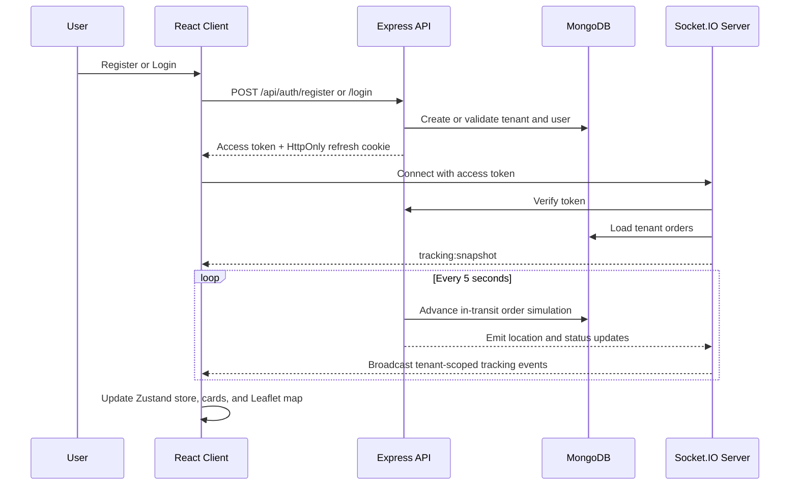

# FleetTrack

FleetTrack is a full-stack fleet operations command center built for logistics teams that need one place to monitor vehicles, drivers, orders, maintenance, and live shipment movement. It combines a React dashboard with a tenant-aware Express + MongoDB backend and real-time Socket.IO updates, so the product feels demo-ready for a hackathon while still following a production-shaped architecture.

## Project Purpose

Most fleet workflows break across too many tools: one screen for dispatch, another for driver status, another for maintenance, and no shared live view of what is happening on the road. FleetTrack brings those workflows into a single workspace so operations teams can:

- track delivery movement in real time
- manage fleet, driver, and order records from one dashboard
- monitor maintenance risk before it turns into downtime
- support tenant-scoped workspaces with secure login and session handling

## What The Project Delivers

- Tenant-scoped authentication with register, login, refresh-session, and logout flows
- Auto-seeded workspace data on registration for instant demo onboarding
- Dashboard KPIs for fleet size, driver activity, dispatch progress, and maintenance alerts
- Operational modules for fleet, drivers, orders, maintenance, and organization settings
- Live tracking powered by Socket.IO with map updates and order-card sync
- Clean reusable UI system built with React, Tailwind CSS, and shared primitives

## Feature Modules

| Module | Purpose |
| --- | --- |
| Dashboard | Gives a control-center summary of fleet activity, dispatch rhythm, queue health, and recent ops events. |
| Fleet | Manages vehicle inventory, assignment visibility, and service-related metadata. |
| Drivers | Tracks driver roster details, assignment status, and operational availability. |
| Orders | Handles dispatch records, status changes, and driver assignment workflows. |
| Live Tracking | Shows India-wide shipment movement on Leaflet maps with backend socket updates. |
| Maintenance | Surfaces maintenance entries, alerts, and service readiness. |
| Settings | Manages tenant profile details and team members with role-aware access. |

## Tech Stack

- Frontend: React 19, Vite, React Router, Zustand, Axios, Tailwind CSS, Leaflet
- Backend: Node.js, Express, Mongoose, Socket.IO, JWT, bcrypt, cookie-parser, helmet, cors
- Database: MongoDB
- Dev workflow: single-command local full-stack runner via `npm run dev`

## Architecture Overview



This split keeps the UI fast and stateful on the client, while the backend owns tenant isolation, authentication, persistence, activity logs, and real-time tracking updates.

## Session And Realtime Flow



## Folder Structure

```text
Hacksagon_FleetTrack_TeamFlux/
|-- README.md
|-- package-lock.json
`-- root/
|   |-- .env
|   |-- .gitignore
|   |-- index.html
|   |-- netlify.toml
|   |-- package.json
|   |-- postcss.config.js
|   |-- tailwind.config.js
|   |-- vite.config.js
|   |-- scripts/
|   |   `-- dev.mjs
|   |-- server/
|   |   |-- .env
|   |   |-- package.json
|   |   `-- src/
|   |       |-- app.js
|   |       |-- index.js
|   |       |-- config/
|   |       |   `-- env.js
|   |       |-- db/
|   |       |   `-- connect.js
|   |       |-- middleware/
|   |       |   `-- auth.js
|   |       |-- models/
|   |       |   |-- ActivityLog.js
|   |       |   |-- Driver.js
|   |       |   |-- MaintenanceAlert.js
|   |       |   |-- MaintenanceEntry.js
|   |       |   |-- Order.js
|   |       |   |-- PasswordResetOtp.js
|   |       |   |-- RefreshSession.js
|   |       |   |-- Tenant.js
|   |       |   |-- User.js
|   |       |   `-- Vehicle.js
|   |       |-- routes/
|   |       |-- services/
|   |       |   |-- activityService.js
|   |       |   |-- authService.js
|   |       |   |-- mailService.js
|   |       |   |-- orderService.js
|   |       |   |-- seedService.js
|   |       |   |-- serializers.js
|   |       |   `-- socketService.js
|   |       `-- utils/
|   `-- src/
|       |-- App.jsx
|       |-- index.css
|       |-- main.jsx
|       |-- assets/
|       |-- components/
|       |   |-- landing/
|       |   `-- ui/
|       |-- constants/
|       |-- context/
|       |-- data/
|       |-- hooks/
|       |-- layouts/
|       |-- pages/
|       |   |-- Dashboard.jsx
|       |   |-- Drivers.jsx
|       |   |-- Fleet.jsx
|       |   |-- ForgotPassword.jsx
|       |   |-- Landing.jsx
|       |   |-- LiveTracking.jsx
|       |   |-- Login.jsx
|       |   |-- Maintenance.jsx
|       |   |-- Orders.jsx
|       |   |-- Register.jsx
|       |   |-- ResetPassword.jsx
|       |   `-- Settings.jsx
|       |-- routes/
|       |-- services/
|       |-- store/
|       `-- utils/
```

## Local Setup

```bash
npm install
npm --prefix server install
```

Create runtime env files from the provided examples:

- `.env` from `.env.example`
- `server/.env` from `server/.env.example`

Then start the full stack:

```bash
npm run dev
```

Useful scripts:

- `npm run dev` - runs frontend and backend together
- `npm run dev:client` - starts the Vite client only
- `npm run dev:server` - starts the Express backend only
- `npm run build` - builds the frontend for production
- `npm run start:server` - starts the backend without watch mode

## Environment Variables

Frontend:

- `VITE_API_BASE_URL`
- `VITE_SOCKET_URL`

Backend:

- `PORT`
- `CLIENT_ORIGIN`
- `MONGODB_URI`
- `JWT_ACCESS_SECRET`
- `JWT_REFRESH_SECRET`

## Why This Project Stands Out

FleetTrack is not just a dashboard mockup. It demonstrates a realistic logistics architecture with secure auth, tenant separation, live socket events, database-backed modules, and a demo-friendly data seeding strategy. That makes it strong both as a hackathon showcase and as a foundation for a more production-ready fleet platform.
