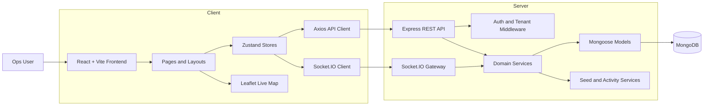
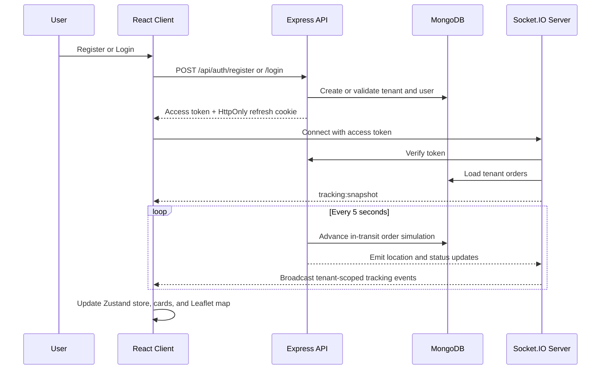

# FleetTrack V2

FleetTrack V2 is a full-stack fleet operations command center built for logistics teams that need one place to monitor vehicles, drivers, orders, maintenance, and live shipment movement. It combines a React dashboard with a tenant-aware Express + MongoDB backend and real-time Socket.IO updates, so the product feels demo-ready for a hackathon while still following a production-shaped architecture.

## Project Purpose

Most fleet workflows break across too many tools: one screen for dispatch, another for driver status, another for maintenance, and no shared live view of what is happening on the road. FleetTrack V2 brings those workflows into a single workspace so operations teams can:

- track delivery movement in real time
- manage fleet, driver, and order records from one dashboard
- monitor maintenance risk before it turns into downtime
- support tenant-scoped workspaces with secure login and session handling

## What The Project Delivers

- Tenant-scoped authentication with register, login, refresh-session, and logout flows
- Secure forgot-password and reset-password flow using OTP over email with brute-force protections
- Auto-seeded workspace data on registration for instant demo onboarding
- Dashboard KPIs for fleet size, driver activity, dispatch progress, and maintenance alerts
- Operational modules for fleet, drivers, orders, maintenance, and organization settings
- Live tracking powered by Socket.IO with map updates and order-card sync
- Clean reusable UI system built with React, Tailwind CSS, and shared primitives

## Feature Modules

| Module | Purpose |
| --- | --- |
| Dashboard | Gives a control-center summary of fleet activity, dispatch rhythm, queue health, and recent ops events. |
| Fleet | Manages vehicle inventory, assignment visibility, and service-related metadata. |
| Drivers | Tracks driver roster details, assignment status, and operational availability. |
| Orders | Handles dispatch records, status changes, and driver assignment workflows. |
| Live Tracking | Shows India-wide shipment movement on Leaflet maps with backend socket updates. |
| Maintenance | Surfaces maintenance entries, alerts, and service readiness. |
| Settings | Manages tenant profile details and team members with role-aware access. |

## Tech Stack

- Frontend: React 19, Vite, React Router, Zustand, Axios, Tailwind CSS, Leaflet
- Backend: Node.js, Express, Mongoose, Socket.IO, JWT, bcrypt, cookie-parser, helmet, cors
- Database: MongoDB
- Dev workflow: single-command local full-stack runner via `npm run dev`

## Architecture Overview



This split keeps the UI fast and stateful on the client, while the backend owns tenant isolation, authentication, persistence, activity logs, and real-time tracking updates.

## Session And Realtime Flow



## Authentication Security Highlights

- Multi-tenant auth checks every login against tenant slug plus user email/password.
- Access tokens are short-lived, while refresh sessions are stored server-side and sent as HttpOnly cookies.
- Forgot-password uses an anti-enumeration response (`If the account exists...`) to avoid leaking account existence.
- Reset OTPs are random numeric codes, hashed with bcrypt in the database, and automatically expire via TTL index.
- OTP verification enforces max-attempt lockout and invalidates previous unconsumed OTPs before issuing a new one.
- Successful password reset revokes all active refresh sessions and clears auth cookies.

## Folder Structure

```text
root/
|-- .env
|-- index.html
|-- netlify.toml
|-- package.json
|-- scripts/
|   `-- dev.mjs
|-- server/
|   |-- .env
|   |-- package.json
|   `-- src/
|       |-- app.js
|       |-- index.js
|       |-- config/
|       |-- db/
|       |-- middleware/
|       |-- models/
|       |-- routes/
|       |-- services/
|       `-- utils/
|-- src/
|   |-- components/
|   |-- context/
|   |-- hooks/
|   |-- layouts/
|   |-- pages/
|   |-- routes/
|   |-- services/
|   |-- store/
|   `-- utils/
`-- README.md
```

## Local Setup

```bash
npm install
npm --prefix server install
```

Create runtime env files manually:

Client env at `root/.env`:

```dotenv
VITE_API_BASE_URL=http://localhost:4000/api
VITE_SOCKET_URL=http://localhost:4000
```

Server env at `root/server/.env`:

```dotenv
NODE_ENV=development
PORT=4000
CLIENT_ORIGIN=http://localhost:5173
APP_BASE_URL=http://localhost:5173

MONGODB_URI=your_mongodb_connection_string
JWT_ACCESS_SECRET=replace_with_strong_random_secret
JWT_REFRESH_SECRET=replace_with_strong_random_secret

SMTP_HOST=smtp_provider_host
SMTP_PORT=587
SMTP_SECURE=false
SMTP_USER=smtp_username
SMTP_PASS=smtp_password
MAIL_FROM=FleetTrack <no-reply@example.com>

PASSWORD_RESET_OTP_LENGTH=6
PASSWORD_RESET_OTP_TTL_MINUTES=10
PASSWORD_RESET_MAX_ATTEMPTS=5
```

Keep both `.env` files out of version control and rotate any leaked credentials immediately.

Then start the full stack:

```bash
npm run dev
```

Useful scripts:

- `npm run dev` - runs frontend and backend together
- `npm run dev:client` - starts the Vite client only
- `npm run dev:server` - starts the Express backend only
- `npm run build` - builds the frontend for production
- `npm run start:server` - starts the backend without watch mode

## Environment Variables

Frontend:

- `VITE_API_BASE_URL` - API base URL, defaults to `http://localhost:4000/api`
- `VITE_SOCKET_URL` - Socket server URL, defaults to API origin when omitted

Backend:

- `NODE_ENV` - `development` or `production`
- `PORT` - backend port (default `4000`)
- `CLIENT_ORIGIN` - allowed frontend origin for CORS
- `APP_BASE_URL` - frontend base URL used in email links
- `MONGODB_URI` - required MongoDB connection string
- `JWT_ACCESS_SECRET` - required secret for access token signing
- `JWT_REFRESH_SECRET` - required secret for refresh token signing
- `SMTP_HOST`, `SMTP_PORT`, `SMTP_SECURE`, `SMTP_USER`, `SMTP_PASS`, `MAIL_FROM` - required for forgot-password OTP emails
- `PASSWORD_RESET_OTP_LENGTH` - OTP digits (minimum `4`, default `6`)
- `PASSWORD_RESET_OTP_TTL_MINUTES` - OTP expiry minutes (minimum `5`, default `10`)
- `PASSWORD_RESET_MAX_ATTEMPTS` - OTP verify attempts before lockout (minimum `1`, default `5`)

If SMTP settings are not configured, forgot-password intentionally returns a `503` configuration error.

## Why This Project Stands Out

FleetTrack V2 is not just a dashboard mockup. It demonstrates a realistic logistics architecture with secure auth, tenant separation, live socket events, database-backed modules, and a demo-friendly data seeding strategy. That makes it strong both as a hackathon showcase and as a foundation for a more production-ready fleet platform.
